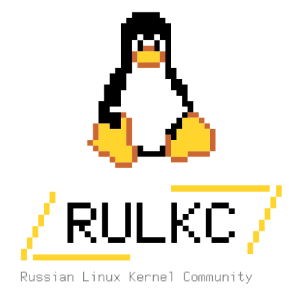

# ⚛️  LANDAU

**Linux And Neo-Depositorium Associated Unity**

---

## 🧪 Что такое LANDAU?

**LANDAU** — это зонтичный проект, объединяющий усилия российского open-source сообщества по развитию ключевых системных компонентов.

Название проекта отсылает к выдающемуся физику-теоретику, нобелевскому лауреату **Льву Давидовичу Ландау** — создателю научной школы, воспитавшей поколения ученых. Как Ландау объединял физиков вокруг новых идей, так и LANDAU призван объединить разработчиков для создания единой технологической базы.

---

## 🎯 Что мы развиваем?

LANDAU охватывает широкий спектр open-source проектов, критически важных для системной экосистемы:

| Проект | Назначение | Статус |
|--------|------------|--------|
| 🐧 **[LANDAU Linux](./landau-linux/)** | Форк ядра LANDAU Linux | ✅ Активен |
| 🖥️ **LANDAU U-Boot** | Форк загрузчика для встраиваемых систем LANDAU u-boot | 🚧 В планах |
| 🔧 **LANDAU EFI** | Поддержка LANDAU UEFI | 🚧 В планах |
| 📦 **LANDAU QEMU** | Эмуляция и виртуализация LANDAU | 🚧 В планах |
| 🏗️ **Другие проекты** | TBD | 🚧 В планах |

---

## 📅 Мероприятия и обсуждения

Мы проводим митапы и конференции (RULKC Meetup #1, OSDevConf 24/25/26), чтобы собрать мнения инженеров и компаний, определить потребности рынка, вместе спроектировать архитектуру будущего форка.

### 🎙️ Список событий

*   **[Открытый микрофон #001: «Форк ядра. Инженеры для инженеров, или при чем тут LANDAU»](./open_mic_27_03_2026.md)**
    *   **📅 Дата:** 27 марта 2026 года
    *   **⏰ Время:** 20:00
    *   **📍 Формат:** Очно / Online
    *   Первая открытая дискуссия о практической инженерной мотивации создания форка, его целях и проблемах, которые он может решить.

### 🗂️ Архив встреч

*   📌 **(Скоро)** Материалы и резюме прошедших круглых столов будут появляться здесь.

---

## 🤝 Контакты и сообщество

### 🌐 Russian Linux Kernel Community

Проект ⚛️ LANDAU развивается под эгидой сообщества RULKC. Присоединяйтесь к нам!

| Канал | Ссылка |
|-------|--------|
| 🏠 **Основной сайт** | [rulkc.org](https://rulkc.org) |
| 📧 **Mail** | [rulinuxkc@gmail.com](mailto:rulinuxkc@gmail.com) |
| 💬 **Telegram-канал** | [https://t.me/linux_kernel_O](https://t.me/linux_kernel_O) |
| 🐙 **GitHub** | [github.com/rulkc](https://github.com/rulkc) |
| 📧 **Mailing List** | [rulkc@linuxtesting.org](mailto:rulkc@linuxtesting.org) |

| | |
|---|---|
|  | **💬 Присоединяйтесь к обсуждению:** Будьте в курсе всех новостей проекта ⚛️ LANDAU и мероприятий RULKC в нашем Telegram-канале: [t.me/linux_kernel_O](https://t.me/linux_kernel_O) |

 

📌 *Этот сайт — отправная точка для навигации по инициативе LANDAU. Все ключевые документы, анонсы и ссылки на репозитории будут добавляться по мере развития проекта.*

## 🤝 Сообщество

LANDAU развивается под эгидой [**Russian Linux Kernel Community (RULKC)**](https://rulkc.org).

| Канал | Ссылка |
|-------|--------|
| 🏠 **Основной сайт** | [rulkc.org](https://rulkc.org) |
| 📧 **Mail** | [rulinuxkc@gmail.com](mailto:rulinuxkc@gmail.com) |
| 💬 **Telegram-канал** | [t.me/linux_kernel_O](https://t.me/linux_kernel_O) |
| 🐙 **GitHub** | [github.com/rulkc](https://github.com/rulkc) |

 

| | |
|---|---|
|  | **💬 Присоединяйтесь к обсуждению** Все новости и анонсы в нашем Telegram-канале |

---

📌 *Этот сайт — центральная точка входа во все проекты LANDAU.*
