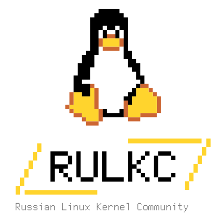

# ⚛️ LANDAU Kernel

**⚡ Linux kernel Advanced for Next-gen Devices & Architectures ⚡**
*(Продвинутое ядро Linux для устройств и архитектур нового поколения)*

---

🧪 **О проекте**

Проект назван в честь выдающегося физика-теоретика, нобелевского лауреата **Льва Давидовича Ландау** — создателя научной школы, воспитавшей поколения ученых. Как Ландау объединял физиков вокруг новых идей, так и наш форк призван объединить российских разработчиков для создания единой кодовой базы ядра.

---

## 🎯 О проекте

**LANDAU** — это инициатива [**Russian Linux Kernel Community (RULKC)**](https://rulkc.org) по созданию единого форка, ориентированного на развитие, а не изоляцию.

Мы видим LANDAU как **upstream-first форк**, улучшающий mainline/stable ветки и работающий по модели **AOSP Common Kernel**:

*   🔄 **Регулярное обновление:** Следование за актуальными версиями mainline / stable (раз в 1–2 месяца).
*   📦 **Приём патчей:** Включение полезных наработок, которые по разным причинам не попали в upstream (драйверы, архитектурные доработки).
*   🖥️ **Поддержка российского железа:** Создание единой ветки ядра как основы BSP для процессоров различных архитектур (ARM, MIPS, RISC-V, Эльбрус), аппаратных платформ и consumer электроники, разрабатываемой в России.
*   👁️ **Прозрачность:** Открытый процесс ревью, современный CI и совместное тестирование.

Проект призван решать как текущие задачи индустрии (сохранение и развитие кода, снижение фрагментации), так и готовить основу для будущего — появления собственных IP- и Core-вендоров, ODM-производителей устройств на отечественных чипах.

---

## 📅 Мероприятия и обсуждения

Мы проводим митапы и конференции (RULKC Meetup #1, OSDevConf 24/25/26), чтобы собрать мнения инженеров и компаний, определить потребности рынка, вместе спроектировать архитектуру будущего форка.

### 🎙️ Список событий

*   **[Открытый микрофон #001: «Форк ядра. Инженеры для инженеров, или при чем тут LANDAU»](./open_mic_27_03_2026.md)**
    *   **📅 Дата:** 27 марта 2026 года
    *   **⏰ Время:** 20:00
    *   **📍 Формат:** Очно / Online
    *   Первая открытая дискуссия о практической инженерной мотивации создания форка, его целях и проблемах, которые он может решить.

### 🗂️ Архив встреч

*   📌 **(Скоро)** Материалы и резюме прошедших круглых столов будут появляться здесь.

---

## 🤝 Контакты и сообщество

### 🌐 Russian Linux Kernel Community

Проект ⚛️ LANDAU развивается под эгидой сообщества RULKC. Присоединяйтесь к нам!

| Канал | Ссылка |
|-------|--------|
| 🏠 **Основной сайт** | [rulkc.org](https://rulkc.org) |
| 📧 **Mail** | [rulinuxkc@gmail.com](mailto:rulinuxkc@gmail.com) |
| 💬 **Telegram-канал** | [https://t.me/linux_kernel_O](https://t.me/linux_kernel_O) |
| 🐙 **GitHub** | [github.com/rulkc](https://github.com/rulkc) |
| 📧 **Mailing List** | [rulkc@linuxtesting.org](mailto:rulkc@linuxtesting.org) |

| | |
|---|---|
|  | **💬 Присоединяйтесь к обсуждению:** Будьте в курсе всех новостей проекта ⚛️ LANDAU и мероприятий RULKC в нашем Telegram-канале: [t.me/linux_kernel_O](https://t.me/linux_kernel_O) |

 

📌 *Этот сайт — отправная точка для навигации по инициативе LANDAU. Все ключевые документы, анонсы и ссылки на репозитории будут добавляться по мере развития проекта.*
