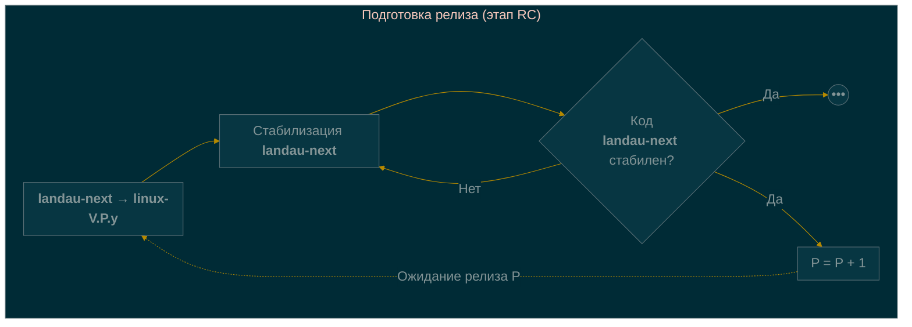
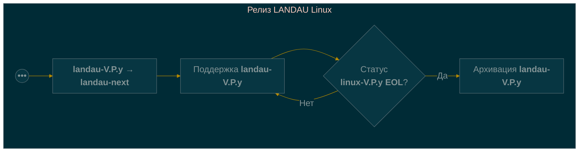
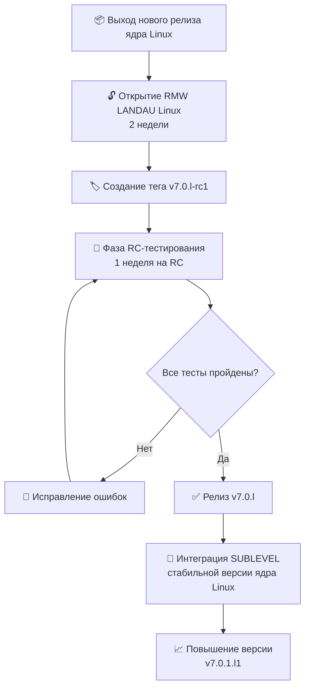
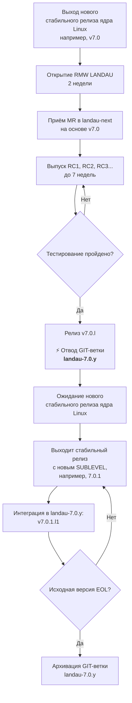

title: "📋 Манифест сопровождения ядра LANDAU Linux"
description: "Описание процесса разработки ядра LANDAU Linux — ветки, релизы, версионирование и сопровождение"
published: true
---

# 📋 Манифест процесса сопровождения ядра LANDAU Linux

> **LANDAU Linux** — форк <u>ядра Linux</u> с собственной схемой версионирования и предсказуемым циклом релизов.
> Этот документ описывает формальный процесс сопровождения (maintenance) проекта.

---

## 🧭 1. Обзор

### 🎯 Цель

Обеспечить стабильный, предсказуемый и документированный процесс выпуска релизов LANDAU Linux с отслеживанием оригинального репозитория ядра Linux.

### Глоссарий
V - VERSION - major версия ядра Linux
P - PATCHLEVEL - middle версия ядра Linux
S - SUBLEVEL - minor версия ядра Linux
E - EXTRAVERSION - поле в версии ядра Linux, в которое встраивается версия ядра LANDAU Linux (ядром Linux обычно используется для -rc релизов (testing фазы))
MR - Merge Request - запрос на слияние одной GIT-ветки с другой. Обычно оформляется в виде ссылки на GIT-репозиторий и ветку авторизованного ментейнера (верифицированного источника) в сопровождение с формальным описанием содержимого. Информация из последнего может быть использована для формирования текста merge-коммита в GIT.
RMW - Rebase & Merge Window - временной отрезок, в рамках которого мейнтейнеры LANDAU переносят подопечный им набор изменений на новую базовую версию ядра.
Bundle - в общем случае это полный набор изменений репозитория LANDAU Linux, который отличает его от оригинального репозитория ядра Linux (фактически это набор патч-серий). Есть общий LANDAU Linux Bundle, а есть Bundle-ы мейнтейнеров в их форках.
EOL - End-of-Life - завершение этапа поддержки выпущенной версии продукта (релиза).

### 📁 Структура GIT-репозитория форка

| Сущность | Назначение |
|----------|-------------|
| `landau-next` | GIT-ветка для следующего релиза LANDAU Linux, куда мейтейнеры отсылают свои MR |
| `landau-V.P.y` | GIT-ветка релиза LANDAU Linux на базе ядра Linux с версией V.P |

> `landau-next` - GIT-ветка для работы всех мейтейнеров вместе. В ней разрешаются конфликты и собираются все MR вместе для создания ветки `landau-V.P.y`. При старте нового RMW её HEAD насильно переносится (_force-push_) на новый релиз ядра Linux.

### 🪞 Зеркала оригинальных репозиториев Linux

На сервере `https://git.rulkc.org` поддерживаются постоянно обновляемые зеркала:

- 🔷 `torvalds/linux` — основная ветка ядра Linux
- 🔷 `stable/linux` — стабильные релизы ядра Linux
- 🔷 `linux-next` — интеграционное дерево linux-next

---

## 🏷️ 2. Схема версионирования

### 📐 Формат версии LANDAU Linux

```
VERSION.PATCHLEVEL.SUBLEVEL.lXYZ
```

| Компонент | Пример | Описание |
|-----------|--------|----------|
| `VERSION` | `7` | Мажорная версия ядра |
| `PATCHLEVEL` | `0` | Минорная версия ядра |
| `SUBLEVEL` | `12` | Номер стабильного обновления ядра |
| `l-rcX` | `l-rc1`, `l-rc2` | Сборочный номер отладочного релиза LANDAU Linux |
| `lXYZ` | `l0`, `l1` | Сборочный номер стабильного релиза LANDAU Linux |


### 🏷️ Git-теги

Используются **аннотированные теги** в формате:

```
v7.0.l-rcX
v7.0.lXYZ
```

Пример: `v7.0.l-rc1`, `v7.0.l0`, `v7.0.l5`

---

## 🌿 3. Cтратегия организации GIT-веток

### 📌 Основные GIT-ветки

| Ветка | Назначение |
|-------|-------------|
| `landau-next` | GIT-ветка следующего релиза LANDAU Linux, куда мейтейнеры отсылают свои MR |
| `landau-V.P.y` | Текущая GIT-ветка для релиза LANDAU Linux на базе <u>стабильного</u> ядра Linux с версией V.P |

### ⏳ Жизненный цикл GIT-веток





| Стадия | Действие |
|--------|----------|
| 🛑 Старт | Принудительное переназначение `landau-next` на базовую версию ядра Linux |
| 🔧 Разработка | Сбор и стабилизация изменений LANDAU в GIT-ветке `landau-next` |
| 🆕 Релиз | Создание `landau-V.P.y` на основе стабильной `landau-next` |
| 🔧 Поддержка | Сбор исправлений ошибок в GIT-ветке `landau-V.P.y` |
| 🐢 Окончание поддержки | Исходная версия достигает EOL |

> В базовом представлении _поддержка_ подразумевает периодическую синхронизацию `landau-V.P.y` с исходной GIT-веткой `linux-V.P.y`.

---

## 📅 4. График релизов

### ⏱️ Цикл релизов ядра Linux

В оригинальном репозитории ядра Linux поддерживается следующий цикл разработки:

| Фаза | ⏰ Длительность | 📝 Описание |
|------|----------------|-------------|
| Разработка | 9-10 недель | Подготовка к новому релизу |
| Rebase & Merge Window | 2 недели | Приём новых Merge Requests от мейнтейнеров |
| RC-тестирование | 7-8 недель | Тестирование кандидатов на релиз |
| Финальный релиз | — | Публикация стабильного ядра |

> ℹ️ **Важно**: Поскольку релизы LANDAU Linux базируются на стабильных релизах ядра Linux, то текущий цикл разработки всегда отстаёт от последней версии ядра Linux на **1 PATCHLEVEL**.

---

## 🔄 5. Процесс выпуска LANDAU Linux

### 📊 Полный цикл релиза



### 5.1 🆕 Новый релиз стабильного ядра Linux

| Шаг | Действие |
|-----|----------|
| 1 | Создать GIT-ветку `landau-7.0.y` от первого релиза стабильного ядра Linux |
| 2 | Применить LANDAU-специфичные патчи |
| 3 | Оставить оригинальные значения `VERSION`, `PATCHLEVEL`, `SUBLEVEL` |
| 4 | Оставить `EXTRAVERSION` пустым (используется `.lX` формат) |
| 5 | Создать тег `v7.0.l-rc1` |

### 5.2 🧪 RC-тестирование

| Параметр | Значение |
|----------|----------|
| ⏱️ Длительность | **1 неделя** на каждый RC |
| 🏷️ Кандидаты | `rc1`, `rc2`, `rc3` ... |
| 🎯 Фокус | Регрессионное тестирование, стабильность, валидация фич |
| 🔧 Исправления | Применяются непосредственно в ветку релиза |

### 5.3 ✅ Финальный релиз

1. Убедиться, что все критические проблемы решены
2. Создать финальный аннотированный тег `v7.0.l`
3. Опубликовать релиз

### 5.4 🔄 Интеграция обновлений SUBLEVEL

| Шаг | Действие | Пример |
|-----|----------|--------|
| 1 | Определить новый `SUBLEVEL` из тега в оригинальном репозитории | `v7.0.1` |
| 2 | Забрать изменения из GIT-ветки репозитория LTS | `git merge v7.0.1` |
| 3 | Повысить LANDAU-версию | `l` → `l1` |
| 4 | Обновить версию | `v7.0.1.l1` |
| 5 | Выпустить релиз | Публикация тега |

---

## 🐢 6. Политика в отношении LTS

Мейнтейнеры LANDAU Linux приняли решение **нативно поддерживать LTS-версии** ядра Linux.

### ⚠️ Ограничения LTS-поддержки

| ✅ Разрешено | ❌ Запрещено |
|--------------|--------------|
| Исправления безопасности | Бэкпорт новых фич |
| Критические багфиксы | Новые драйверы |
| Стабилизирующие патчи | Изменения подсистем |
| Документация | Любые не-багфиксы |

> 📌 **Принцип**: Поддерживается тот Changelog, который был на момент отвода LTS основного ядра.

### 🛑 Окончание поддержки

| Тип ядра | Условие окончания поддержки |
|----------|------------------------------|
| Обычное | Исходный релиз достигает EOL |
| LTS | Поддержка продолжается до EOL базовой версии (без добавления новых фич) |

Гарантировано LANDAU Linux Owners поддерживают одно последнее LTS ядро. Про остальные LTS ядра думаем при наличии ресурсов.

---

## 👤 7. Обязанности мейнтейнера

| Область | Ответственность |
|---------|------------------|
| 👁️ Мониторинг исходного репозитория | Отслеживание новых релизов и RC-циклов |
| 📦 Применение патчей | Интеграция LANDAU-специфичных изменений ядра |
| 🏷️ Управление тегами | Создание аннотированных тегов в формате `vX.Y.lZ` |
| 🧪 Координация RC | Организация тестирования кандидатов на релиз |
| 🔒 Безопасность | Мониторинг и применение исправлений безопасности |
| 📝 Документирование | Ведение changelog для каждого LANDAU-релиза |

---

## 📖 8. Пример полного цикла релиза

### Исходные данные

Выпущено ядро Linux версии **`6.12.0`**

### 📍 Пошаговый пример

#### 👁️ Схема

| Этап | Действие | Результат | Версия сборки |
|------|----------|-----------|---------------|
| 1 | Force-push GIT-ветки `landau-next` на `v7.0` | `landau-next` | — |
| 2 | Старт RMW | `landau-next` | `N/A` |
| 3 | Создание RC1 | `v7.0.l-rc1` | `7.0.l-rc1` |
| 4 | Создание RC2 | `v7.0.l-rc2` | `7.0.l-rc2` |
| 5 | Создание RC3 | `v7.0.l-rc3` | `7.0.l-rc3` |
| 6 | **Финальный релиз** и **создание нумерованной GIT-ветки** | `v7.0.l`<br>`landau-7.0.y` | `7.0.l` |
| 7 | Выходит оригинальный релиз `7.0.1` | Слияние изменений в `landau-7.0.y` | — |
| 8 | Обновление версии | `v7.0.1.l1` | `7.0.1.l1` |
| 9 | Исходная версия `7.0.x` получает статус EOL | GIT-ветка `landau-7.0.y` архивируется | — |

#### 🔄 Детальное описание процесса

1. **Выход нового стабильного релиза ядра Linux** (например, `v7.0` по результатам 7 недель стабилизации)
2. **Открытие RMW LANDAU Linux** — берём 2 недели на свой релиз LANDAU Linux:
   - Затаскиваем патч-серии (MR) в ветку `landau-next`, на основе `v7.0`
   - Там же происходит решение всех конфликтов
   - Формируются первые общие сборки ядра
3. **Выпуск RC-версий** (например, `v7.0.l-rc1`) — RC-релизы делаются в GIT-ветке `landau-next`
4. **Тестирование** — длится до 7 недель (может быть меньше):
   - Выпускаются RC-версии: `rc1`, `rc2`, `rc3` и т.д.
5. **Финальный релиз и отвод стабильной ветки**:
   - Выпускаем релиз `v7.0.l`
   - Создаём стабильную GIT-ветку **`landau-7.0.y`** на базе последнего релиза
   - Вся дальнейшая поддержка этой версии ведётся в `landau-7.0.y`
6. **Завершение цикла `landau-next`**:
   - Ветка `landau-next` останавливает свой рост на первом релизе `v7.0.l`
   - Переключается на шаг 1, когда в исходном репозитории Linux выходит новый стабильный релиз (например, `v7.1`)
7. **Интеграция новых изменений SUBLEVEL из исходной стабильной версии ядра Linux**:
   - Если в исходном репозитории меняется SUBLEVEL (например, `7.0.1`), мы интегрируем данный релиз в **`landau-7.0.y`**
   - Повышаем свою версию: `v7.0.1.l1`
   - То есть повышается версия LANDAU Linux, а SUBLEVEL получает новое значение согласно интегрированным изменениям
8. **Развитие стабильной версии**:
   - Стабильная версия LANDAU Linux `v7.0` ведётся в ветке `landau-7.0.y`
9. **Окончание поддержки релиза**:
   - Поддержка релиза ветки LANDAU Linux заканчивается, когда версия основного ядра больше не имеет статус стабильной на kernel.org (например, `7.0` достигла статуса EOL)
10. **LTS-поддержка**:
    - Если основное ядро уходит в LTS, LANDAU поддерживает LTS до конца
    - Приносятся только фиксы LANDAU Linux (без новых фич) и новые SUBLEVEL
11. **Гарантии поддержки**:
    - LANDAU Linux Owners гарантированно поддерживают **одно последнее LTS ядро**
    - Про поддержку более старых LTS ядер думаем при наличии ресурсов

#### 📊 Визуализация цикла



#### 🏷️ Пример полной цепочки тегов

Для ядра `7.0.x` в LANDAU:

```
v7.0.l-rc1  →  v7.0.l-rc2  →  v7.0.l-rc3  →  v7.0.l
                                                  ↓
                                          отвод landau-7.0.y
                                                  ↓
                                          v7.0.1.l1  →  v7.0.2.l2  →  ...
```

---

### Требования к патчам

TODO

### Pull requests

TODO

### Maintainers B4 usage

TODO

---

## 📚 9. Ссылки и ресурсы

| Ресурс | URL |
|--------|-----|
| 📦 Репозитории LANDAU | `https://git.rulkc.org/pub/scm/landau` |
| 🪞 Зеркала репозиториев Linux| `https://git.rulkc.org` |
| 🔗 Оригинальные репозитории Linux | `https://kernel.org` |

---

> 📌 **Актуальная версия документа**: 1.0  
> ✍️ **Поддерживается**: LANDAU Maintainers
> 📅 **Последнее обновление**: 2026

[⬅️ Вернуться на страницу LANDAU Linux](./index.md)
