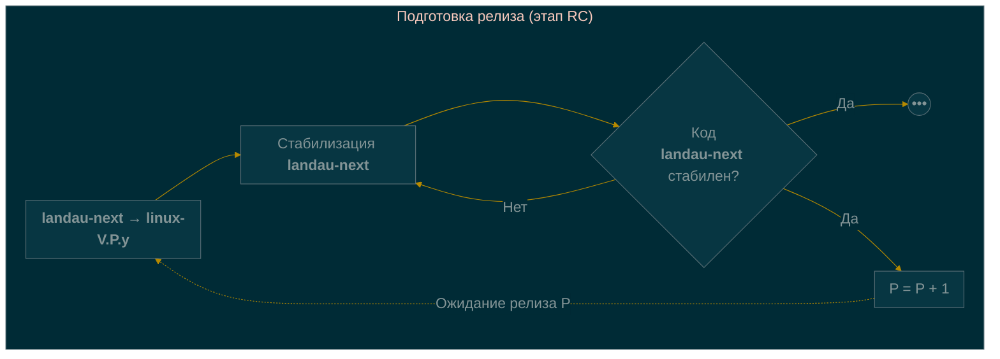
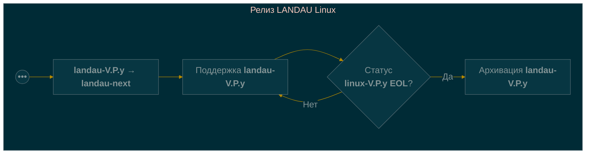
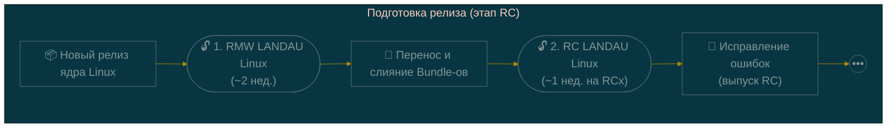
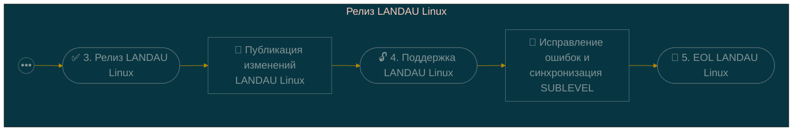
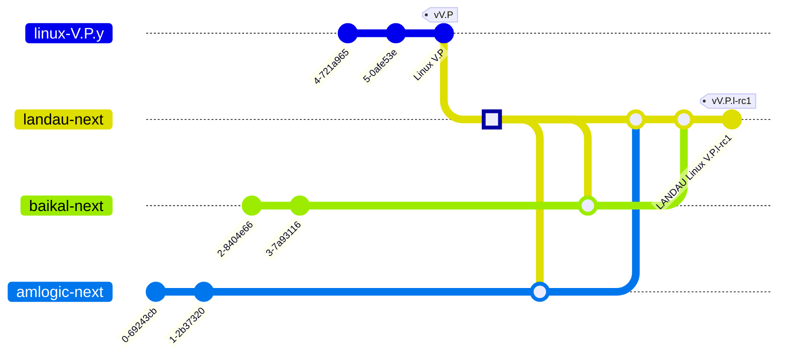

title: "📋 Манифест сопровождения ядра LANDAU Linux"
description: "Описание процесса разработки ядра LANDAU Linux — ветки, релизы, версионирование и сопровождение"
published: true
---

# 📋 Манифест процесса сопровождения ядра LANDAU Linux

> **LANDAU Linux** — форк <u>ядра Linux</u> с собственной схемой версионирования и предсказуемым циклом релизов.
> Этот документ описывает формальный процесс сопровождения (maintenance) проекта.

---

## 🧭 1. Обзор

### 🎯 Цель

Обеспечить стабильный, предсказуемый и документированный процесс выпуска релизов LANDAU Linux с отслеживанием оригинального репозитория ядра Linux.

### 📖 Глоссарий

| Термин | Полное название | Описание |
|--------|-----------------|----------|
| **V** | VERSION | Major версия ядра Linux. Определяет основной номер версии (например, `6` в `6.12.7`). |
| **P** | PATCHLEVEL | Middle версия ядра Linux. Определяет минорный номер версии (например, `12` в `6.12.7`). |
| **S** | SUBLEVEL | Minor версия ядра Linux. Определяет номер стабильного обновления (например, `7` в `6.12.7`). |
| **E** | EXTRAVERSION | Поле в версии ядра Linux, в которое встраивается версия ядра LANDAU Linux. Ядром Linux обычно используется для `-rc` релизов. |
| **MR** | Merge Request | Запрос на слияние одной Git-ветки с другой. Оформляется в виде ссылки на Git-репозиторий и ветку авторизованного мейнтейнера с формальным описанием. |
| **RMW** | Rebase & Merge Window | Временной отрезок (2 недели), в рамках которого мейнтейнеры LANDAU переносят свои изменения на новую базовую версию ядра. |
| **Bundle** | — | Полный набор изменений репозитория LANDAU Linux, отличающий его от оригинального ядра Linux. Есть общий Bundle и Bundle-ы мейнтейнеров. |
| **EOL** | End-of-Life | Завершение этапа поддержки выпущенной версии продукта. Ветка больше не получает обновлений и архивируется. |

### 🪞 Зеркала оригинальных репозиториев Linux

На сервере `https://git.rulkc.org` поддерживаются постоянно обновляемые зеркала:

- 🔷 `torvalds/linux` — основная ветка ядра Linux
- 🔷 `stable/linux` — стабильные релизы ядра Linux
- 🔷 `linux-next` — интеграционное дерево linux-next

---

## 🏷️ 2. Схема версионирования

### 📐 Формат версии LANDAU Linux

```
VERSION.PATCHLEVEL.SUBLEVEL.lXYZ
```

| Компонент | Пример | Описание |
|-----------|--------|----------|
| `VERSION` | `7` | Мажорная версия ядра |
| `PATCHLEVEL` | `0` | Минорная версия ядра |
| `SUBLEVEL` | `12` | Номер стабильного обновления ядра |
| `l-rcX` | `l-rc1`, `l-rc2` | Сборочный номер отладочного релиза LANDAU Linux |
| `lXYZ` | `l`, `l1` | Сборочный номер стабильного релиза LANDAU Linux |

### 🏷️ Git-теги

Используются **аннотированные теги** в формате:

```
v7.0.l-rcX
v7.0.lXYZ
```

Пример: `v7.0.l-rc1`, `v7.0.l`, `v7.0.l5`

---

## 🌿 3. Cтратегия организации GIT-веток

### 📌 Основные GIT-ветки

| Ветка | Назначение |
|-------|-------------|
| `landau-next` | GIT-ветка следующего релиза LANDAU Linux, куда мейтейнеры отсылают свои MR |
| `landau-V.P.y` | Текущая GIT-ветка для релиза LANDAU Linux на базе <u>стабильного</u> ядра Linux с версией V.P |

> `landau-next` - GIT-ветка для работы всех мейтейнеров вместе. В ней
> разрешаются конфликты и собираются все MR вместе для создания ветки
> `landau-V.P.y`. При старте нового RMW её HEAD насильно переносится
> (_force-push_) на новый релиз ядра Linux.

### ⏳ Жизненный цикл GIT-веток





| Стадия | Действие |
|--------|----------|
| 🛑 Старт | Принудительное переназначение `landau-next` на базовую версию ядра Linux |
| 🔧 Разработка | Сбор и стабилизация изменений LANDAU в GIT-ветке `landau-next` |
| 🆕 Релиз | Создание `landau-V.P.y` на основе стабильной `landau-next` |
| 🔧 Поддержка | Сбор исправлений ошибок в GIT-ветке `landau-V.P.y` |
| 🐢 Окончание поддержки | Исходная версия достигает EOL |

> В базовом представлении _поддержка_ подразумевает периодическую синхронизацию `landau-V.P.y` с исходной GIT-веткой `linux-V.P.y`.

---

## 📅 4. График релизов

### ⏱️ Цикл релизов ядра Linux

В оригинальном репозитории ядра Linux поддерживается следующий цикл разработки:

| Фаза | ⏰ Длительность | 📝 Описание |
|------|----------------|-------------|
| Разработка | 9-10 недель | Подготовка к новому релизу |
| Rebase & Merge Window | 2 недели | Приём новых Merge Requests от мейнтейнеров |
| RC-тестирование | 7-8 недель | Тестирование кандидатов на релиз |
| Финальный релиз | — | Публикация стабильного ядра |

> ℹ️ **Важно**: Поскольку релизы LANDAU Linux базируются на стабильных релизах ядра Linux, то текущий цикл разработки всегда отстаёт от последней версии ядра Linux на **1 PATCHLEVEL**.

---

## 🔄 5. Процесс выпуска LANDAU Linux

### 📊 Полный цикл релиза





### 5.1 🆕 Этап RMW LANDAU Linux

| Шаг | Действие |
|-----|----------|
| 1 | Создать GIT-ветку `landau-next` от первого релиза стабильного ядра Linux |
| 2 | Объявить сбор изменений LANDAU Linux от нижестоящих ментейнеров |
| 3 | Применить изменения LANDAU Linux в `landau-next` |
| 4 | Запросить повторную публикуцию изменений в случае сложных конфликтов |
| 5 | Провести базовое сборочное тестирование результирующей ветки `landau-next` |
| 6 | Обновить `EXTRAVERSION` на `l-rc1` и создать коммит "LANDAU Linux V.P.l-rc1" |
| 7 | Отметить коммит аннотированным тегом `vV.P.l-rc1` |

> ℹ️ Переменная `EXTRAVERSION` в стабильных релизах ядра Linux остаётся пустым, потому может быть использована для сохранения версий LANDAU Linux. При этом оригинальные значения `VERSION`, `PATCHLEVEL`, `SUBLEVEL` в дальнейшем сохраняются для индикации версии исходного ядра Linux.

| Параметр | Значение |
|----------|----------|
| ⏱️ Длительность | **~2 недели** |
| 🎯 Фокус | Сбор и базовая проверка работоспособности продуктов |
| 🏷️ Релизы | `l-rc1` |
| 🔧 Исправления | Незначительные проблемы разрешаются в merge-коммитах. Значительные - через повторный запрос изменения от ментейнера |

### 5.2 🧪 Этап RC LANDAU Linux

| Шаг | Действие |
|-----|----------|
| 1 | Получить корректирующие изменений LANDAU Linux от нижестоящих ментейнеров |
| 2 | Применить корректирующие изменения LANDAU Linux в `landau-next` |
| 3 | Провести базовое сборочное тестирование результирующей ветки `landau-next` |
| 4 | Cоздать коммит "LANDAU Linux V.P.l-rcX" для инкрементированной в `EXTRAVERSION` RC-версии |
| 5 | Отметить коммит аннотированным тегом `vV.P.l-rcX` |
| 6 | Перейти к 1. в случае выявления ошибок |

| Параметр | Значение |
|----------|----------|
| ⏱️ Длительность | **~1 неделя** на каждый RC, но **не более 7-8 недель** |
| 🎯 Фокус | Регрессионное тестирование, стабильность, валидация фич |
| 🏷️ Релизы | `l-rc1`, `l-rc2`, `l-rc3` ... |
| 🔧 Исправления | Применяются непосредственно в ветку релиза по запросу нижестоящих ментейнеров |

> ℹ️ Стабилизация GIT-ветки `landau-next` (отсуствие выявленных ошибок в очреденом RC-цикле) символизирует окончание этапа RC и выход на релиз.

### 5.3 ✅ Релиз LANDAU Linux

| Шаг | Действие |
|-----|----------|
| 1 | Убедиться в отсуствии существенных проблем на последнем этапе RC |
| 2 | Обновить `EXTRAVERSION` на `l` и создать коммит "LANDAU Linux V.P.l" |
| 3 | Отметить коммит аннотированным тегом `vV.P.l` |
| 4 | Создать GIT-ветку `landau-V.P.y` на основе последнего RC-релиза LANDAU Linux |

| Параметр | Значение |
|----------|----------|
| ⏱️ Длительность | **более 1 недели** в последней фазе RC |
| 🎯 Фокус | Стабилизация собранных измений и опубликование списка изменений |
| 🏷️ Релизы | `l` |
| 🔧 Исправления | Отсуствуют в рамках последней фазы RC |

### 5.4 🔄 Поддержка стабильной и LTS-версий LANDAU Linux

| Шаг | Действие | Пример |
|-----|----------|--------|
| 1 | Определить последний `SUBLEVEL` в исходной GIT-ветки стабильного ядра Linux | `v7.0.1` |
| 2 | Применить изменения из стабильной GIT-ветки ядра Linux в `landau-V.P.y` | `git merge v7.0.1` |
| 3 | Получить корректирующие изменений LANDAU Linux от нижестоящих ментейнеров | - |
| 4 | Применить корректирующие изменения LANDAU Linux в `landau-V.P.y` при наличии | - |
| 5 | Инкрементировать `EXTRAVERSION` на единицу и создать коммит "LANDAU Linux V.P.Y.lX" | `l` → `l1` |
| 6 | Отметить коммит аннотированным тегом `vV.P.Y.lX` | `v7.0.1.l1` |

| Параметр | Значение |
|----------|----------|
| ⏱️ Длительность | До получения статуса EOL исходной версии ядра Linux |
| 🎯 Фокус | Исправление серьезных ошибок, выявленных в стабильном релизе LANDAU Linux |
| 🏷️ Релизы | `l1`, `l2`, `l2`, ...  |
| 🔧 Исправления | Применяются по запросу нижестоящих ментейнеров в рамках корректирующих релизов |

Мейнтейнеры LANDAU Linux приняли решение **нативно поддерживать стабильные и LTS-версии** ядра Linux до получения статуса EOL. Однако гарантировано корректирующие изменения LANDAU Linux портируются в LANDAU Linux на основе последней LTS-версии ядра Linux. Портирование изменений в более ранние версии возможно при наличии ресурсов.

⚠️ Особенности интеграции изменений в стабильную и LTS версии LANDAU Linux:

| ✅ Разрешено | ❌ Запрещено |
|--------------|--------------|
| Исправления безопасности | Бэкпорт новых фич |
| Критические багфиксы | Новые драйверы |
| Стабилизирующие патчи | Изменения подсистем |
| Документация | Любые не-багфиксы |

> 📌 **Принцип**: Поддерживается тот Changelog, который был на момент отвода LTS основного ядра.

### 5.5 🔄 Завершение поддержки релиза LANDAU Linux (EOL)

| Шаг | Действие |
|-----|----------|
| 1 | Получение статуса EOL исходной версии стабильного ядра Linux |
| 2 | Объявление о завершении поддержки LANDAU Linux в GIT-ветке `landau-V.P.y` |

| Параметр | Значение |
|----------|----------|
| ⏱️ Длительность | Минимум несколько корректирующих релизов стабильной версии LANDAU Linux до регистрации EOL |
| 🎯 Фокус | Завершение поддержки релиза |
| 🏷️ Релизы | `lZ` |
| 🔧 Исправления | Не применяются |

Поддержка **стабильной и LTS версий** LANDAU Linux завершается либо вместе с получением статуса EOL исходной версии ядра Linux, либо после выпуска релиза LANDAU Linux, основанного на последней LTS-версии ядра Linux.

---

## 👤 6. Обязанности мейнтейнера

| Область | Ответственность |
|---------|------------------|
| 👁️ Мониторинг исходного репозитория | Отслеживание новых релизов и RC-циклов |
| 📦 Применение патчей | Интеграция LANDAU-специфичных изменений ядра |
| 🏷️ Управление тегами | Создание аннотированных тегов в формате `vV.P.lZ` |
| 🧪 Координация RC | Организация тестирования кандидатов на релиз |
| 🔒 Безопасность | Мониторинг и применение исправлений безопасности |
| 📝 Документирование | Ведение changelog для каждого LANDAU-релиза |

### Личные репозитории ментейнеров

В личных репозиториях ментейнеры хранят и развивают собственные форки ядра Linux с подведомственным им набором изменений. В целом, способ организации персональных репозиториев ментейнеры могут выбирать самостоятельное. Например, можно разделить независимые изменения на GIT-ветки по подсистемам и отправлять MR с каждым из них, либо предварительно объединить их в единую GIT-ветку и отправить один целостный MR. При этом необходимо придерживаться правила **преемственности предыдущих изменений и минимизации merge-конфликтов**. То есть GIT-ветка, отправляемая в MR главному ментейнеру, должна сохранять историю предыдущих изменений LANDAU Linux и их исправлений, а также содержать последнюю версию оригинальной версии ядра Linux, для которого готовится релиз LANDAU Linux. Для реализации такого требования удобно использовать подход **двойного слияния**, суть которого в том, чтобы сначала ментейнеры своих репозиториев LANDAU Linux (sub-LANDAU Linux) выполнили слияние своих GIT-веток с `landau-next`, разрешили все конфликты и лишь потом отправляли MR в рамках этапа RMW:



Таким образом, основная нагрузка по исправлению конфликтов ложится на нижестоящих ментейнеров. Главному ментейнeру остаётся лишь собрать все MR в `linux-next`. Если и в этом случае возникают сложные конфликты, то главный ментейнер вправе попросить выполнить повторный цикл **двойного слияния**, чтобы кросс sub-LANDAU Linux конфликты были разешены на стороне нижестоящих ментейнеров.

К тому же опционально ментейнеры могут выполнять поддержку GIT-веток с патч-сетами для последующей отправки изменений в оригинальный репозиторий ядра Linux. До момента интеграции патч-сеты могут "поглощать" исправления и стилистические изменения в процессе перебазирования на новую версию ядра Linux. Это упрощает сопровождение таких GIT-веток, минимизируя лог изменений, который к тому же является лишним при интеграции в ядро Linux.

---

## 📖 7. Пример полного цикла релиза

### Исходные данные

Выпущено ядро Linux версии **`7.0`**. Это означает, что в оригинальном репозитории ядра Linux изменения, добавленные в период окна слияния, достаточно стабилизировались, этап RC завершён, EXTRAVERSION принимает пустое значение, последний коммит символизирует релиз ядра Linux 7.0, а в GIT-репозитории стабильных и LTS веток появляется новая ветка `linux-7.0.y`.

### 📍 Пошаговый пример

#### 👁️ Схема

| Этап | Действие | Результат | Версия сборки |
|------|----------|-----------|---------------|
| 1 | Force-push GIT-ветки `landau-next` на `v7.0` | `landau-next` | — |
| 2 | Старт RMW | `landau-next` | `N/A` |
| 3 | Создание RC1 | `v7.0.l-rc1` | `7.0.l-rc1` |
| 4 | Создание RC2 | `v7.0.l-rc2` | `7.0.l-rc2` |
| 5 | Создание RC3 | `v7.0.l-rc3` | `7.0.l-rc3` |
| 6 | **Финальный релиз** и **создание нумерованной GIT-ветки** | `v7.0.l`<br>`landau-7.0.y` | `7.0.l` |
| 7 | Выходит оригинальный релиз `7.0.1` | Слияние изменений в `landau-7.0.y` | — |
| 8 | Обновление версии | `v7.0.1.l1` | `7.0.1.l1` |
| 9 | Исходная версия `7.0.x` получает статус EOL | GIT-ветка `landau-7.0.y` архивируется | — |

#### 🔄 Детальное описание процесса

1. **Выход нового стабильного релиза ядра Linux** (например, `v7.0` по результатам 7 недель стабилизации)
2. **Открытие RMW LANDAU Linux** — берём 2 недели на свой релиз LANDAU Linux:
   - Затаскиваем патч-серии (MR) в ветку `landau-next`, на основе `v7.0`
   - Там же происходит решение всех конфликтов
   - Формируются первые общие сборки ядра
3. **Выпуск RC-версий** (например, `v7.0.l-rc1`) — RC-релизы делаются в GIT-ветке `landau-next`
4. **Тестирование** — длится до 7 недель (может быть меньше):
   - Выпускаются RC-версии: `l-rc1`, `l-rc2`, `l-rc3` и т.д.
5. **Финальный релиз и отвод стабильной ветки**:
   - Выпускаем релиз `v7.0.l`
   - Создаём стабильную GIT-ветку **`landau-7.0.y`** на базе последнего релиза
   - Вся дальнейшая поддержка этой версии ведётся в `landau-7.0.y`
6. **Завершение цикла `landau-next`**:
   - Ветка `landau-next` останавливает свой рост на первом релизе `v7.0.l`
   - Переключается на шаг 1, когда в исходном репозитории Linux выходит новый стабильный релиз (например, `v7.1`)
7. **Интеграция новых изменений SUBLEVEL из исходной стабильной версии ядра Linux**:
   - Если в исходном репозитории меняется SUBLEVEL (например, `7.0.1`), мы интегрируем данный релиз в **`landau-7.0.y`**
   - Повышаем свою версию: `v7.0.1.l1`
   - То есть повышается версия LANDAU Linux, а SUBLEVEL получает новое значение согласно интегрированным изменениям
8. **Развитие стабильной версии**:
   - Стабильная версия LANDAU Linux `v7.0` ведётся в ветке `landau-7.0.y`
9. **Окончание поддержки релиза**:
   - Поддержка релиза ветки LANDAU Linux заканчивается, когда версия основного ядра больше не имеет статус стабильной на kernel.org (например, `7.0` достигла статуса EOL)
10. **LTS-поддержка**:
    - Если основное ядро уходит в LTS, LANDAU поддерживает LTS до конца
    - Приносятся только фиксы LANDAU Linux (без новых фич) и новые SUBLEVEL
11. **Гарантии поддержки**:
    - LANDAU Linux Owners гарантированно поддерживают **одно последнее LTS ядро**
    - Про поддержку более старых LTS ядер думаем при наличии ресурсов

#### 🏷️ Пример полной цепочки тегов

Для ядра `7.0.x` в LANDAU:

```
v7.0.l-rc1  →  v7.0.l-rc2  →  v7.0.l-rc3  →  v7.0.l
                                                  ↓
                                          отвод landau-7.0.y
                                                  ↓
                                          v7.0.1.l1  →  v7.0.2.l2  →  ...
```

---

### Требования к патчам

TODO

### Pull requests

TODO

### Maintainers B4 usage

TODO

---

## 📚 8. Ссылки и ресурсы

| Ресурс | URL |
|--------|-----|
| 📦 Репозитории LANDAU | `https://git.rulkc.org/pub/scm/landau` |
| 🪞 Зеркала репозиториев Linux| `https://git.rulkc.org` |
| 🔗 Оригинальные репозитории Linux | `https://kernel.org` |

---

> 📌 **Актуальная версия документа**: 1.0  
> ✍️ **Поддерживается**: LANDAU Maintainers
> 📅 **Последнее обновление**: 2026

[⬅️ Вернуться на страницу LANDAU Linux](./index.md)
