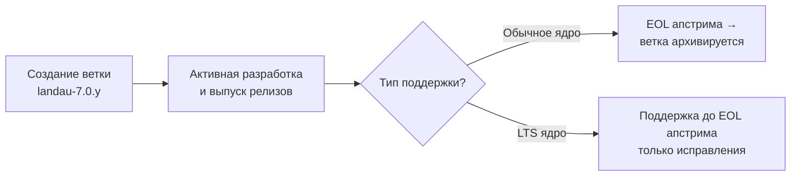
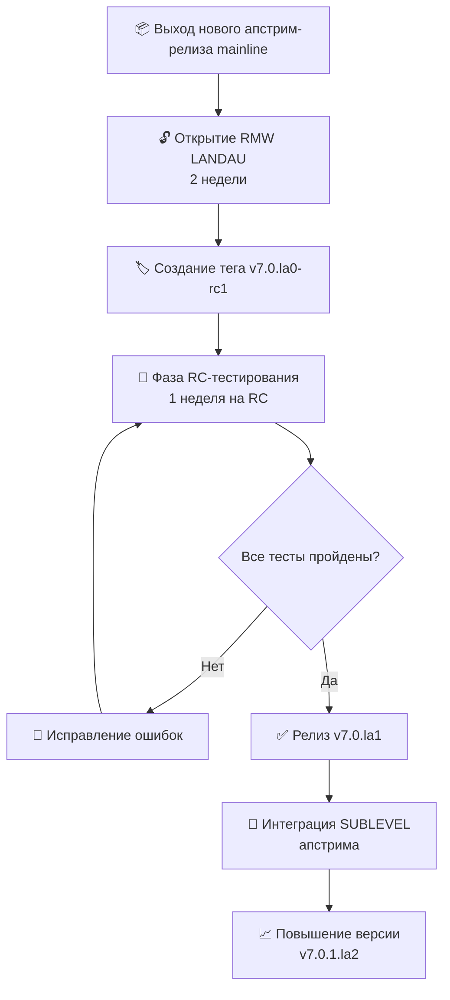

title: "📋 Манифест сопровождения LANDAU"
description: "Официальный процесс maintenance LANDAU Linux — версионирование, ветки, релизы и LTS"
published: true
---

# 📋 Манифест процесса сопровождения LANDAU

> **LANDAU** — форк ядра Linux с собственной схемой версионирования и предсказуемым циклом релизов.  
> Этот документ описывает формальный процесс сопровождения (maintenance) проекта.

---

## 🧭 1. Обзор

### 🎯 Цель

Обеспечить стабильный, предсказуемый и документированный процесс выпуска LANDAU-релизов с отслеживанием апстрим-ядра Linux.

### 📁 Структура репозитория

| Сущность | Назначение |
|----------|-------------|
| `landau-mainline` | Отслеживание апстрим-ветки **mainline** |
| `landau-7` | Стабильная серия **LANDAU 7.x** |

### 🪞 Апстрим-зеркала

На сервере `https://git.rulkc.org` поддерживаются постоянно обновляемые зеркала:

- 🔷 `torvalds/linux` — основная ветка ядра
- 🔷 `stable/linux` — стабильные релизы
- 🔷 `linux-next` — интеграционное дерево linux-next

---

## 🏷️ 2. Схема версионирования

### 📐 Формат версии LANDAU

```
VERSION.PATCHLEVEL.SUBLEVEL.lXYZ
```

| Компонент | Пример | Описание |
|-----------|--------|----------|
| `VERSION` | `6` | Мажорная версия ядра |
| `PATCHLEVEL` | `12` | Минорная версия |
| `SUBLEVEL` | `7` | Номер стабильного обновления апстрима |
| `lXYZ` | `l0`, `l1` | Сборочный номер LANDAU |

### 🏷️ Git-теги

Используются **аннотированные теги** в формате:

```
v7.0.lXYZ
```

Пример: `v7.0.l0`, `v7.0.l5`

### ⚙️ Конфигурация локальной версии

```makefile
CONFIG_LOCALVERSION="-bt1"
```

### 📊 Примеры вывода `scripts/setlocalversion`

| 📍 Состояние репозитория | 🔧 Вывод |
|--------------------------|----------|
| ✅ Тег на HEAD, нет локальных изменений | `6.12.l0-bt1` |
| ✏️ Тег на HEAD, есть локальные изменения | `6.12.l0-bt1-dirty` |
| 📜 Тег есть, но коммиты поверх него | `6.12.l0-bt1-00465-gc49d0c66a4b7` |
| 🔀 Тег есть, коммиты поверх, есть локальные изменения | `6.12.l0-bt1-00465-gc49d0c66a4b7-dirty` |

---

## 🌿 3. Веточная стратегия

### 📌 Основные ветки

| Ветка | Назначение |
|-------|-------------|
| `landau-mainline` | Отслеживание апстрим-ветки mainline, разработка новых фич |
| `landau-7.y` | Ветки стабильных релизов (например, `landau-7.0.y`) |

### ⏳ Жизненный цикл ветки



| Стадия | Действие |
|--------|----------|
| 🆕 Создание | От тега апстрим-релиза |
| 🔧 Разработка | Ветка `landau-7.0.y` |
| 🛑 Окончание поддержки | Апстрим достигает EOL |
| 🐢 LTS | Только исправления (без новых фич) |

---

## 📅 4. График релизов

### ⏱️ Апстрим-график

| Фаза | ⏰ Длительность | 📝 Описание |
|------|----------------|-------------|
| Разработка | 9-10 недель | Подготовка к новому релизу |
| Merge Window | 2 недели | Приём новых возможностей |
| RC-тестирование | 7-8 недель | Тестирование кандидатов на релиз |
| Финальный релиз | — | Публикация стабильного ядра |

> ℹ️ **Важно**: Релизы LANDAU отстают от апстрима на **1 patchlevel (SUBLEVEL)**.

---

## 🔄 5. Процесс выпуска LANDAU

### 📊 Полный цикл релиза



### 5.1 🆕 Новый релиз mainline

| Шаг | Действие |
|-----|----------|
| 1 | Создать ветку `landau-7.0.y` от тега апстрим-релиза |
| 2 | Применить LANDAU-специфичные патчи |
| 3 | Установить `VERSION`, `PATCHLEVEL`, `SUBLEVEL` по апстриму |
| 4 | Оставить `EXTRAVERSION` пустым (используется `.lX` формат) |
| 5 | Создать тег `v7.0.la0-rc1` |

### 5.2 🧪 RC-тестирование

| Параметр | Значение |
|----------|----------|
| ⏱️ Длительность | **1 неделя** на каждый RC |
| 🏷️ Кандидаты | `rc1`, `rc2`, `rc3` ... |
| 🎯 Фокус | Регрессионное тестирование, стабильность, валидация фич |
| 🔧 Исправления | Применяются непосредственно в ветку релиза |

### 5.3 ✅ Финальный релиз

1. Убедиться, что все критические проблемы решены
2. Создать финальный аннотированный тег `v7.0.la1`
3. Опубликовать релиз

### 5.4 🔄 Интеграция апстрим-обновлений SUBLEVEL

| Шаг | Действие | Пример |
|-----|----------|--------|
| 1 | Определить новый `SUBLEVEL` из апстрим-тега | `v7.0.1` |
| 2 | Смержить апстрим-изменения | `git merge v7.0.1` |
| 3 | Повысить LANDAU-версию | `l1` → `l2` |
| 4 | Обновить версию | `v7.0.1.la2` |
| 5 | Выпустить релиз | Публикация тега |

---

## 🐢 6. Политика в отношении LTS

Мейнтейнеры LANDAU приняли решение **нативно поддерживать LTS-версии** апстрим-ядра.

### ⚠️ Ограничения LTS-поддержки

| ✅ Разрешено | ❌ Запрещено |
|--------------|--------------|
| Исправления безопасности | Бэкпорт новых фич |
| Критические багфиксы | Новые драйверы |
| Стабилизирующие патчи | Изменения подсистем |
| Документация | Любые не-багфиксы |

> 📌 **Принцип**: Поддерживается тот Changelog, который был на момент отвода LTS основного ядра.

### 🛑 Окончание поддержки

| Тип ядра | Условие окончания поддержки |
|----------|------------------------------|
| Обычное | Апстрим достигает EOL |
| LTS | Поддержка продолжается до EOL апстрима (без добавления новых фич) |

---

## 👤 7. Обязанности мейнтейнера

| Область | Ответственность |
|---------|------------------|
| 👁️ Мониторинг апстрима | Отслеживание новых релизов и RC-циклов |
| 📦 Применение патчей | Интеграция LANDAU-специфичных изменений |
| 🏷️ Управление тегами | Создание аннотированных тегов в формате `vX.Y.lZ` |
| 🧪 Координация RC | Организация тестирования кандидатов на релиз |
| 🔒 Безопасность | Мониторинг и применение апстрим-исправлений безопасности |
| 📝 Документирование | Ведение changelog для каждого LANDAU-релиза |

---

## 📖 8. Пример полного цикла релиза

### Исходные данные

Апстрим выпускает ядро **`6.12.0`**

### 📍 Пошаговый пример

| Этап | Действие | Результат | Версия сборки |
|------|----------|-----------|---------------|
| 1 | Создание ветки от `v6.12` | `landau-6.12.y` | — |
| 2 | Создание RC1 | `v6.12.l0-rc1` | `6.12.l0-bt1` |
| 3 | Создание RC2 | `v6.12.l0-rc2` | `6.12.l0-bt1` |
| 4 | Создание RC3 | `v6.12.l0-rc3` | `6.12.l0-bt1` |
| 5 | **Финальный релиз** | `v6.12.l1` | `6.12.l1-bt1` |
| 6 | Апстрим выпускает `6.12.1` | Слияние изменений | — |
| 7 | Обновление версии | `v6.12.1.l2` | `6.12.1.l2-bt1` |
| 8 | Апстрим объявляет EOL для `6.12` | Ветка архивируется | — |

---

## 📚 9. Ссылки и ресурсы

| Ресурс | URL |
|--------|-----|
| 📦 Репозиторий LANDAU | `https://github.com/rulkc/landau` |
| 🪞 Зеркала апстрима | `https://git.rulkc.org` |
| 🔗 Апстрим-ядро | `https://kernel.org` |

---

> 📌 **Актуальная версия документа**: 1.0  
> ✍️ **Поддерживается**: LANDAU Maintenance Team  
> 📅 **Последнее обновление**: 2026
